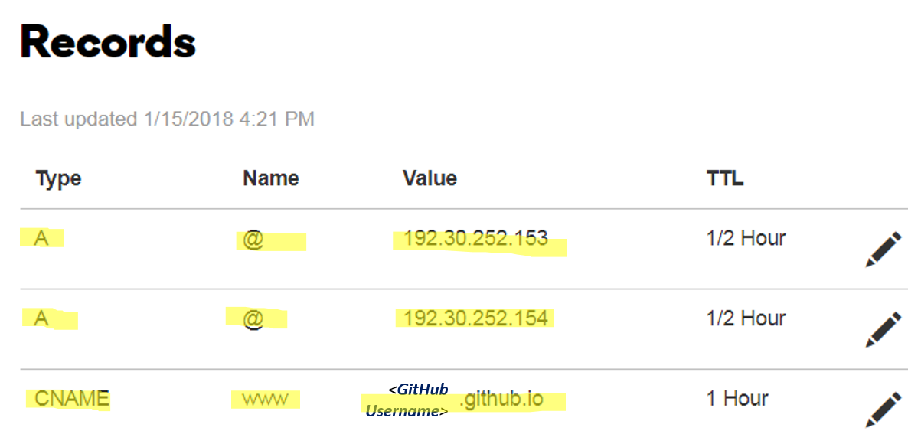

[//]: # "* Will be replaced with the ToC, excluding the 'Contents' header"
[//]: # "{:toc}"

I started to build my own website about one week ago, it takes a lot of searching and comparing effort.   
I am sharing the best practice in my mind in developing you own website. Please find the detailed step-by-step process in the following.  
In my opinion, it is a one day project :) Feel free to leave comments at the bottom.

### Use GitHub as the host of the website
1. Register one account at [GitHub.com](https://github.com/)
   * If you are first time to GitHub, please check this nice tutorial video
     

2. Fork one of the existing Jekyll themes from GitHub repository. I used Dean Attali's [_Beautiful Jekyll theme_](https://github.com/daattali/beautiful-jekyll)
   * Click the link above at go to the repository for _Beautiful Jekyll theme_
   * The Fork button is located at the top right corner (right below your username)  

3. Rename the folder forked as `<username>.github.io`, where the `<username>` is the github user name you registered at step 1
   * Now your website should be running
   * Open a new tab in the web browser; input `https:<username>.github.io` and your own website is there!!

4. Customize the website settings
   * The major custom files are located at `\_config.yml`, `aboutme.md` and files in folder `_posts` 
   * The basic markdown tutorial can be found [here](https://www.markdowntutorial.com/)
   * `\_config.yml` has detailed explanation; please go through them line-by-line.

   Following is a gif cartoon showing the detailed process, made by [Dean Attali](https://deanattali.com/beautiful-jekyll/)
   

### Personalize your website with your own domain name
1. Register your own domain 
   * [GoDaddy](https://www.godaddy.com/), [NameCheap](https://www.namecheap.com/) and [Google domain](https://domains.google/#/) are all available to register your personal domain, _\*.com_ is highly recommended
   * Pick up your preferred domain name and register it. _Please do not forget to Google whether there is any coupon available_
   * Now you owned your own domain name
   
2. Connect the GitHub website with your custom domain name.
   * Use GoDaddy as an example in this tutorial
   * [Configuration](https://help.github.com/articles/adding-or-removing-a-custom-domain-for-your-github-pages-site/) on the GitHub side.

      * Log into GitHub account → Go to `<username>.github.io` repository → Settings 
   			

      * Scroll down to `GitHub Pages` section → Add your domain name to box under `Custom domain` → Save!
   			

   * Configuration on GoDaddy side.

      * Log into your GoDaddy account → Go to `My Domains` → Click the `Manage`
      	 	

      * Click `Manage DNS` under Domain Settings → Add the following in the Records
      	 	

3. Wait a few minutes, type your own domain name into the web browser. :)
